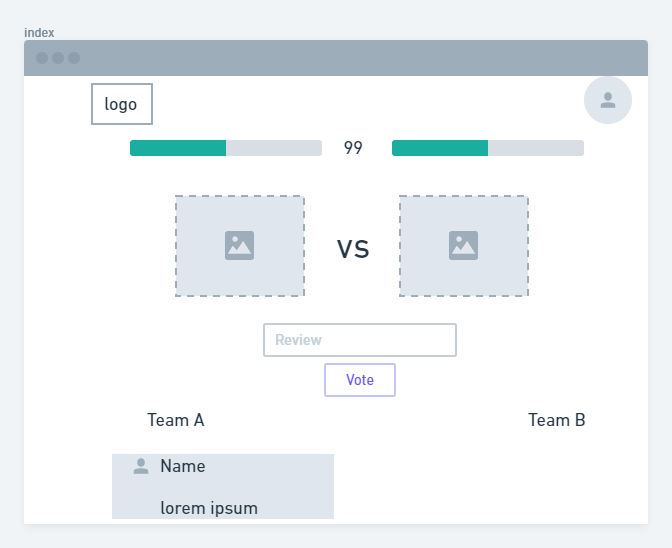
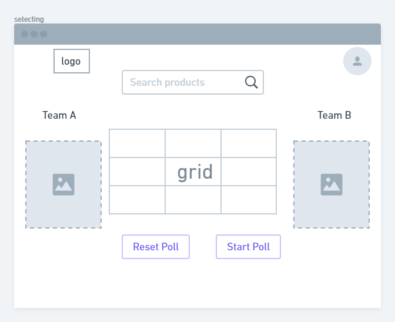

# Real Trends challenge
This is the soluction to the challenge made by Real Trends. Make a real time poll, consuming the API of ML. The project is made with nextjs, firebase auth, and firestore for the backend. 

You can check out [the specs for the projects here](https://github.com/goncy/realtrends-challenge) 

# Setup
This application uses Firebase services. Configuration required to connect to Firebase is defined in the .env file in the root of this repository.

Before building or running the app, you must add your own Firebase project configuration.

# Installation

```bash
npm install

npm run dev

```


# Live Demo
Try a live version at https://versus-challenge-realt.vercel.app/

# proposed UI
Two page, the first to vote for a product, the second to choose the products for the poll
<center></center>

<center></center>


# Creative process 📋
-   Install nextjs
-   create tsconfig to enable typescript
-   instal ' npm install --save-dev typescript @types/react @types/node'
-   npm run dev to autocreate the tsconfig
-   install linter of the projects
-   install firebase
-   create the project in firebase and import the config in a .env file
-   create the firebaseConfig
-   Select the login option in react-firebaseui (Google and Github seen good idea)
-   create firebaseAuth
-   Styles? in sass?
-   Create authProvider, maybe a product Provider?
-   Why not working? because you always forget use the provider in _app.tsx 😆
-   Why not working yet? because you have to restart when changes the _app.tsx
-   Create a folder component
-   Should i create a config folder? maybe
-   Create a basic layout and use it in the _app.tsx
-   Styles?, bring the big gun. Style Components. 'npm i styled-components ' 'npm i --save-dev @types/styled-components'
-   Is neccesary install  "babel-plugin-styled-components" as -D?
-   Create the GlobalStyle and use it in the _app.tsx
-   GlobalStyle use types?.
-   **Turn off the strict mode of typescript for a while.**
-   boilerplate ready.

## Brainstorm 🤯
-   We need a page for the poll, and maybe other page for select products from Meli.
-   The select page should be access only by admin to avoid multiples users creating a poll.
-   Make the poll page like a Battle (mortal kombat), we need two products, a life score, a timer, input for the review, select and option, the results above. We need the name of the voter. THE USER NEED TO BE LOGIN TO VOTE.
-  From the user Login we can use the name, and the profilePic?
-   For the selecting page, we can search a keywords and select two products for the poll. Name, picture, permalink? price? ID
- Store the products in firestore
- Bring data from firestore in the versus poll. Vote.
- Button to reset?
- The vote page should be private? or only the vote.

# Steps2
-  Layout > Create the header with logo and login button, profile pic if is login.
-  Layout > create a footer
-  create the poll board in the index
-  PROBLEMS TO IMPORT SVG FILES. fix later
-  problems with styled components, have to create .babelrc, and _document.tsx
-  create the components for the navbar login, logout button.    

- create UI for select products
- search bar? modal?
-  install axios
- connect to the MELI's API
- display grid

### I MUST COMPLETE THE LOG


